# PROYECT: OLYMPIC GAMES NEWS

# INDEX

- [PROYECT: OLYMPIC GAMES NEWS](#proyect-olympic-games-news)
- [INDEX](#index)
  - [Objetives](#objetives)
    - [General Objetives](#general-objetives)
    - [Specific Objetives](#specific-objetives)
  - [General Description](#general-description)
  - [General Diagram of The System](#general-diagram-of-the-system)
  - [System Flow Explanation](#system-flow-explanation)
    - [Local Machine](#local-machine)
    - [Google Load Balancer](#google-load-balancer)
    - [API Replicas](#api-replicas)
    - [Services on Google Cloud Platform](#services-on-google-cloud-platform)
    - [Virtual Machines On The Cloud](#virtual-machines-on-the-cloud)
    - [Google Pub Sub](#google-pub-sub)
    - [App Engine](#app-engine)
  - [Cloud Run - App](#cloud-run---app)
  - [Databases](#databases)
  - [Reflection Questions](#reflection-questions)
  - [Overrides](#overrides)
  - [Deliverables](#deliverables)
    - [Github repository](#github-repository)

## Objetives

### General Objetives

Create a distributed computing system, cloud native, by using different services from **Google Cloud Platform**, **operating-system-level virutalization** with **Docker** and **ContainerD** and traffic generators to be applied to a current topic.

### Specific Objetives

- Apply the knowledge of containers, images, composition files, and networks between containers.
- Experiment with and use **Cloud Native Technologies** that help develop modern distributed systems.
- Generate traffic and divide it on the network using specific tools such as **Locust** and **Cloud Load Balancer.**
- Create a web app using the library **React**, one of the frameworks with the most labor demand in the market.
- Use a wide range of **IaaS**, **PaaS** and **SaaS** cloud services from the GCP provider.
- Use modern languages to create a distributed application.
- Compare two different databases in the cloud: **Azure Cosmos DB** and **Google Cloud SQL.**

## General Description

After the end of the Tokyo 2021 Olympic games, the initiative is taken by your group of students from the course of
operating systems 1 in order create a visualizer of the news and commentary of the Olympics
that the spectators are doing.
The system will be entirely in the cloud, using different services from the Google Cloud Platform and a database on
Cosmos DB from Microsoft Azure. It will have a massive load of data from different
traffic generators, the information to send will be detailed later. In addition to this system,
there will be an "Administrator" mode in which you can view relevant graphs and metrics of the
news, and information on RAM and virtual machines to be created in the cloud.

## General Diagram of The System

> Areas:

- [Local Machine](#local-machine) (Purple Rectangle)
- [API Replicas](#api-replicas) (Blue Rectangle)
- Google Gloud Platform (External skyblue square)
  - [Virtual Machines In The Cloud](#virtual-machines-on-the-cloud) (Internal skyblue square)
- [Databases](#databases) (Green Rectangle)

> 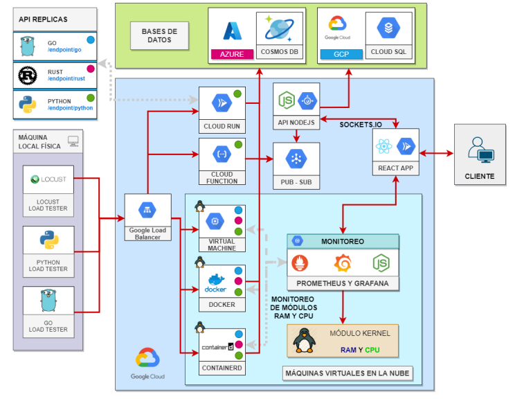

## System Flow Explanation

The system will have different parts, each of which is crucial for the system to work properly. These parts are divided by colors in the [diagram above](#general-diagram-of-the-system).

### Local Machine

The components in this part will be stored in the members' local machine, these do not need be in the cloud.
The purpose of the applications in this part is to send traffic to the **Google Cloud Load Balancer**
(detailed later). Basically these applications have to have the following functionalities:

- Read a `.json` file that contains an array of data (the respective data for each traffic generator).
- Process the file and send traffic to an endpoint.
- Show how much data was sent and how much data had error.

The information to be sent by the three traffic generators is the following:

```
{
	"name" : "Mary Miller", // name of the person who published a commentary
	"commentary": "These competitions were awesome", // content of the commentary
	"date" : "24/07/2021", // date when commentary was done
	"hashtags" : ["Karate","Javeline","Archery","Judo"], // array with associated hashtags to commentary
	"upvotes" : "100", // number of upvotes for the commentary
	"downvotes" : "30" // number of downvotes for the commentary
}
```

### Google Load Balancer

A Cloud Load Balancer must be configured [https://cloud.google.com/load-balancing](https://cloud.google.com/load-balancing) which will receive all the
traffic created by `Locust` and the other two traffic generators, this will redirect the traffic to the different services to implement.

### API Replicas

There will be three APIs that will work in exactly the same way (hence the "replica") but they will be
made in different languages. The functionality of these APIs is to receive the traffic that is generated and passes through
the Load Balancer, to then pass this information to the database and create a notification using Google
PubSub. The student should consider which routes are necessary to pass this traffic, but as a start
and suggestion are the following:

- `/startLoad`: A path that will be able to connect to the database and wait for the data to be loaded.
- `/publish`: A path that will have the option of publishing the information to the database.
- `/finalLoad`: A route that will close the connection to the databases and send a notification through from Google PubSub.

The three languages to implement will be:

- Python
- Go
- Rust

For each of these languages, the same API functionality to connect to the database must created
so that they send information from traffic generators. Also, a notification via `Google Pub/Sub` must be created to know how many records were uploaded.

### Services on Google Cloud Platform

> CLLOUD RUN - APIS

The services from Python and Go APIs will be uploaded to Google Cloud Run.

> CLOUD FUNCTIONS

The services from Python and Go APIs will be uploaded to Google Functions

### Virtual Machines On The Cloud

Three different Virtual Machines will be created on Google Compute Engine, each one with the 3 previous APIs mentioned installed, considering the following details of installation and configuration:

| Image                                              | Description                                                                                                                                                                                                                                                                                                                                                                                                                                                                  |
| -------------------------------------------------- | ---------------------------------------------------------------------------------------------------------------------------------------------------------------------------------------------------------------------------------------------------------------------------------------------------------------------------------------------------------------------------------------------------------------------------------------------------------------------------- |
| 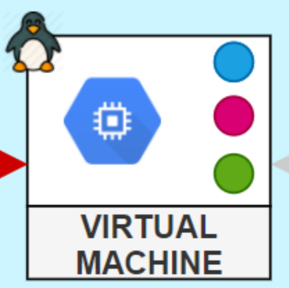 | In this Virtual machine you will have the three APIs: Python, Rust and Go. This Virtual machine will use **Debian** operating system. In this virtual machine there will **NOT** be any type of OS-level virtualization, this means that the environments of the three APIs sould be configured independently and in the host operating system. **Notice how there is a Linux symbol at the top left, this means Kernel modules will be installed in this virtual machine.** |
| 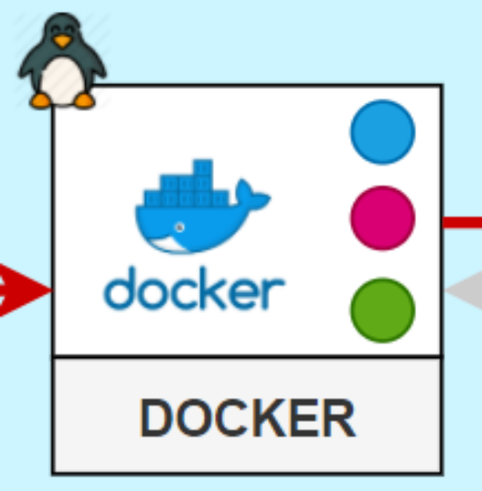 | In this Virtual machine you will have the three APIs: Python, Rust and Go. This Virtual machine will use **CentOS** operating system. In this VM, **Docker** will be used as the container controller for the three APIs mentioned above. This means that they will have a container with Python, another with Rust and another with Go. **Notice how there is a Linux symbol at the top left, this means Kernel modules will be installed in this virtual machine.**        |
| 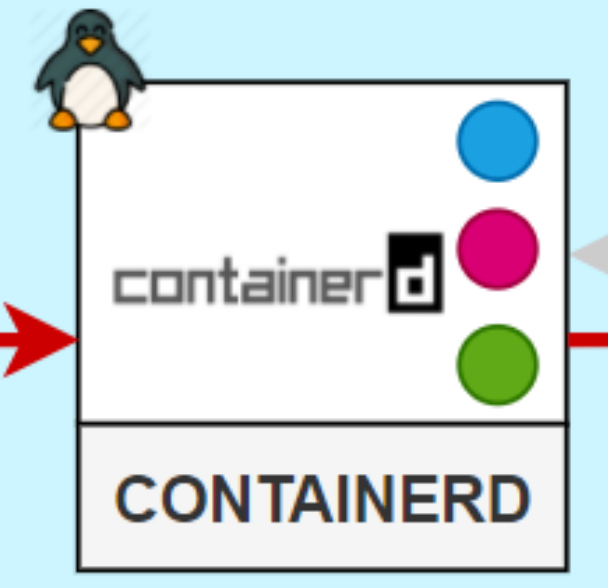 | In this Virtual machine you will have the three APIs: Python, Rust and Go. This Virtual machine will use **CentOS** operating system. In this VM, **ContainerD** will be used as the container controller for the three APIs mentioned above. This means that they will have a container with Python, another with Rust and another with Go. **Notice how there is a Linux symbol at the top left, this means Kernel modules will be installed in this virtual machine.**    |

> RAM MODULE

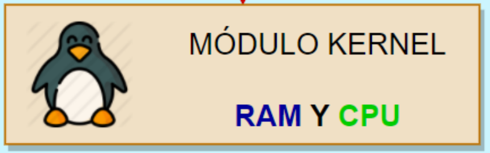 <br clear="left"/><br/>

Mount a Module to read system RAM information. This module must provide the following information.

- Total RAM memory (MB).
- RAM memory in use (MB).
- Free RAM memory (MB).
- Percentage of RAM memory in use.

To validate, the values must be the same as shown by the command:

    $ free --mega -t

> PROCESSES LIST MODULE

Mount a module to read sysmtem CPU information. This module must provide the following information.

- Percentage of CPU used.
- Number of process in execution.

To validate, the values must be the same as shown by the command:

    $ free --mega -t

The kernel modules must be developed using C as programming language.
They must be mounted on the three virtual machines that contain the APIs.
The way to read this file and sending it to the monitoring module is at the discretion of the student. It's recommended to:

- Implemment an endpoint in the API of your choice (the simplest would be in Python) to read the
  content of the files from the / proc directory and send it by an HTTP request to the monitoring module.

> MONITORING MODULE

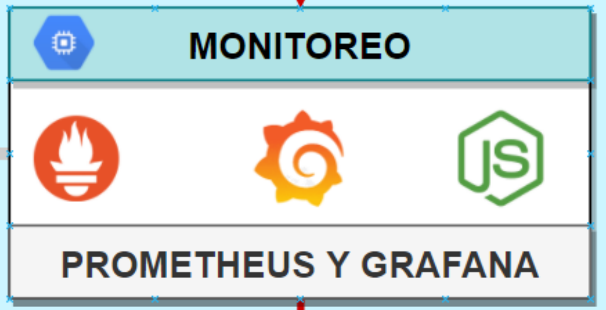 <br clear="left"/><br/>

In this module it is intended to generate a Dashboard using Prometheus and Grafana to display information of the RAM (all that appears in the Kernel) and the information of the CPU and number of processes running. How to obtain this information is at the discretion of the student. It is recommended:

- Implement a NodeJS API that requests the information through an HTTP request to the virtual machines where the Kernel modules are located and read the information from NodeJS to prometheus.

for more information visit: https://codersociety.com/blog/articles/nodejs-application-monitoring-with-prometheus-and-grafana

The monitoring module must be in a virtual machine, either one dedicated solely for this, or one
of those that already have APIs. The way to implement the grafana dashboard is at the discretion of the
student, however it is recommended to adapt a previously made Dashboards to the information handled by the RAM and CPU.

Dashboard Example
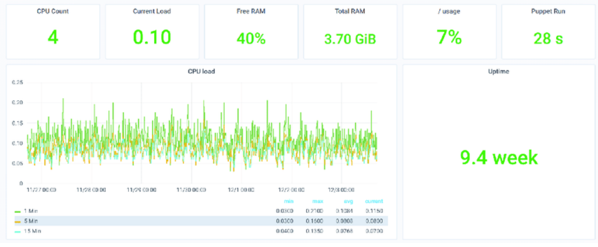 <br clear="left"/><br/>

### Google Pub Sub

Google Pub / Sub will be used to send notifications about the loading of information from the APIs to the main API of Node JS. The information in this notification is as follows:

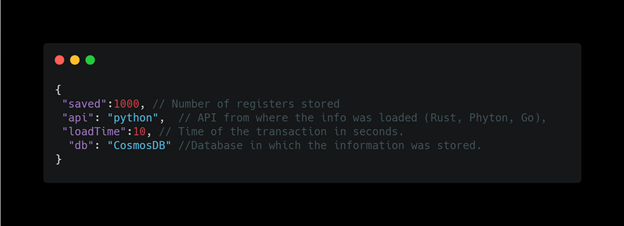 <br clear="left"/><br/>

The notification will be triggered every time one of the traffic generators is finished loading, it means a notification will not arrive for each saved record just for the total of records. If 200 records are sent from the generator, you must show a single notification with the total of 200 saves.

### App Engine

This API will be written with Javascript using NodeJS. The purpose of this API will be collecting data to be displayed in the client application. In addition to making reports with the information you have stored (detailed later). **This API will be uploaded in the APP ENGINE of Google Cloud.**

Important: This API will connect to the APP through the **Socket.IO module.** to simulate a real time application.

## Cloud Run - App

> APP WEB:

Create a web application using the React framework. It will show the different metrics according to the data stored in the CosmosDB and CloudSQL server. The application of UX/UI and responsive concepts for the design of the app will be taken into account in the qualification. Finally, the APP made in React must be published using Google Cloud Run.

> Information view:

The information must be displayed in its entirety. The views in which the information will be displayed are at the discretion of the student, however, it should be noted that the aesthetics and usability of the APP will be graded. To get an idea of how to display the information you can use http://twitter.com as a reference.

Below, there are some references about how to handle views:

> News and messages view:

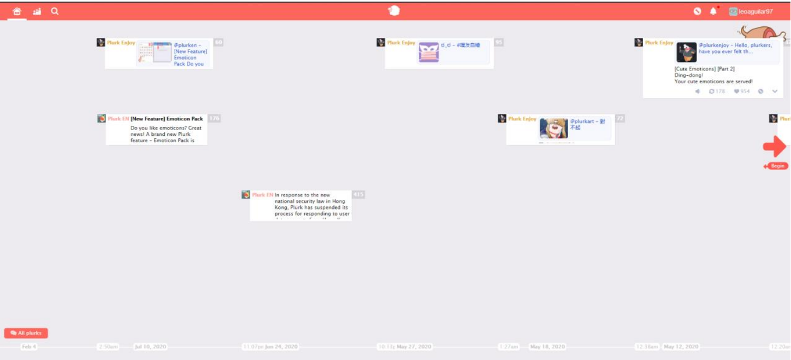 <br clear="left"/><br/>

> View of a news item:

 <br clear="left"/><br/>

> Report view:

Apart from the information displayed in the database, you are asked to make the following reports in tabular form, these reports must be in real time using Sockets.IO.

- Show the total number of news, upvotes and hashtags (different) in the system.
- Table with the data in the system.
- Pie chart of the top 5 hashtags. It will be calculated from the number of upvotes each hashtag has.
- Graph (bar, line, stacketed, etc...) comparing the number of upvotes and downvotes per day.

You should also add a button or filter with which you can decide from which database to run the reports (i.e. you should implement the reports in both databases). It is recommended to use the following
library: https://canvasjs.com/react-charts

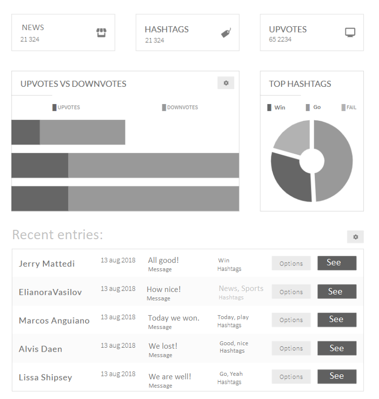 <br clear="left"/><br/>

## Databases

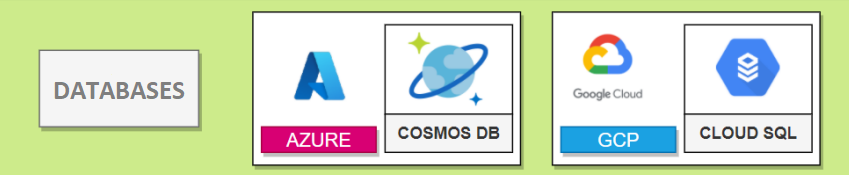 <br clear="left"/><br/>

One of the objectives of this project is the comparison between the CosmosDB database and the use of the CloudSQL service, making also a multi-cloud project.

A Cosmos DB database must be set up using Microsoft Azure and another database of your choice (mysql, postgresql, sql) using CloudSQL on Google Cloud Platform.

Both databases will contain the same information in each of them. The information will come to them through the replicated APIs described above, and will be consumed by the Rest API to be processed and then displayed in the React web application. How the data will be stored is at the student's discretion.

## Reflection Questions

The questions will constitute a high weighting of the total project score, and only answers that have a supporting implementation, i.e., the Prometheus and Grafana module must be completed to be eligible to answer the question for that module, will be scored. All questions must be submitted with their respective answer in the technical manual, and will be asked in the qualification. The questions to be answered are the following:

- Which traffic generator is faster? What are the differences between the traffic generator implementations?
- Which programming language used for the APIs was the most optimal with respect to response time between requests? Which language had the least optimal performance?
- Which of the Google Cloud Platform services was the best for implementing APIs? Which was the worst? Why?
- Do you consider it better to use Containerd or Docker and why?
- Which database had the lowest latency between responses and supported the highest load at any given time? Which of the two would you recommend for such a project?
- Do you find it useful to use Prometheus and Grafana to create dashboards, why?

## Overrides

- The project will be carried out in groups of no more than 3 people.
- A private GitHub or Gitlab repository should be created where all team members will collaborate.
- Commits will be reviewed and each member will be checked for contributions to the repository.
- Only implementations with the above languages and restrictions will be considered.
- An input file will be provided on the day of grading, however, a file with the same structure will be provided from the start so that they can test.
- If copies are found, the student will receive a score of 0 points and will be reported to the school of science and systems.
- Late deliveries will not be accepted.

## Deliverables

The mode of delivery will be through UEDI, just attach the link to your repository, the delivery will be per group so only one person must deliver, the space will be available in days close to the delivery date. Only groups that expect to finish on the stipulated date should submit.

### Github repository

In addition to adding each assistant, the repository must contain the following files: (In the folder organization that best suits the student).

- Dockerfiles
- Docker-compose files
- React source code
- Locust file
- Python Traffic Generator
- Go Traffic Generator
- Python API Code
- Rust API Code
- Go API Code
- Code used with Google Pub Sub
- JavaScript code used for the NodeJS API
- RAM module C code
- C code for the Process module
- Any other necessary configuration files
- Entity-relationship models or database object models
- Technical manual, with answers to the reflection questions.
- User manual
